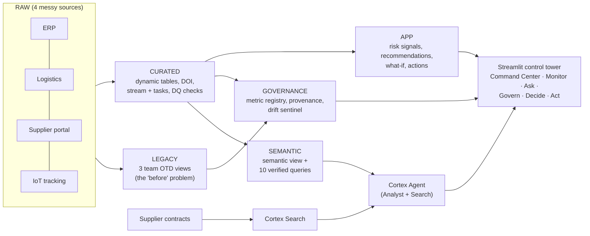
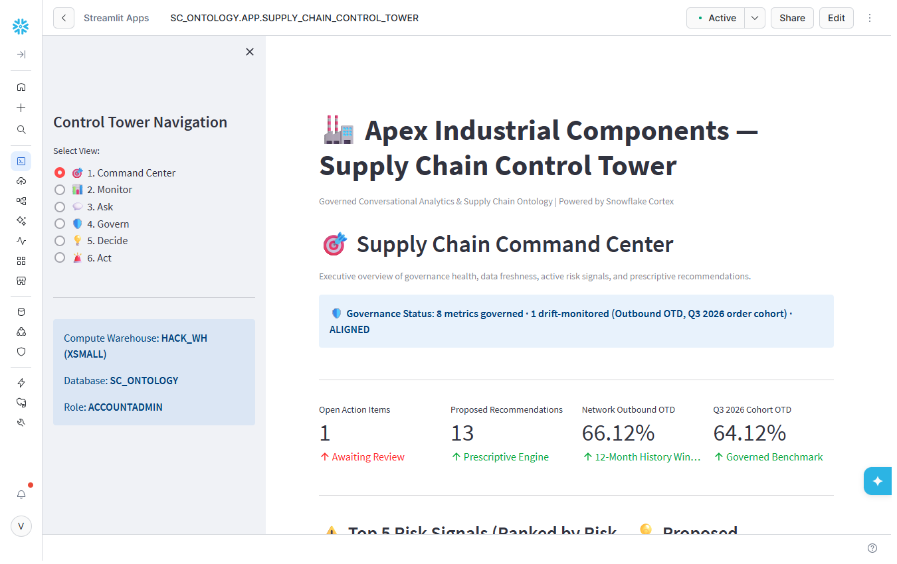
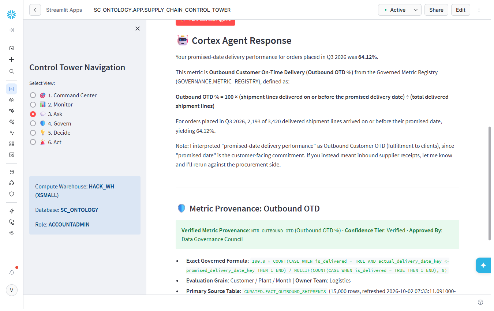
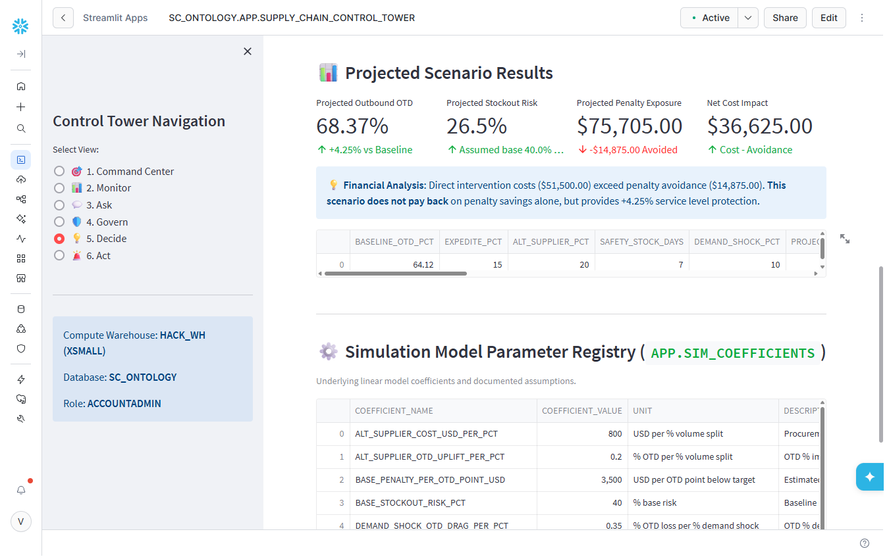
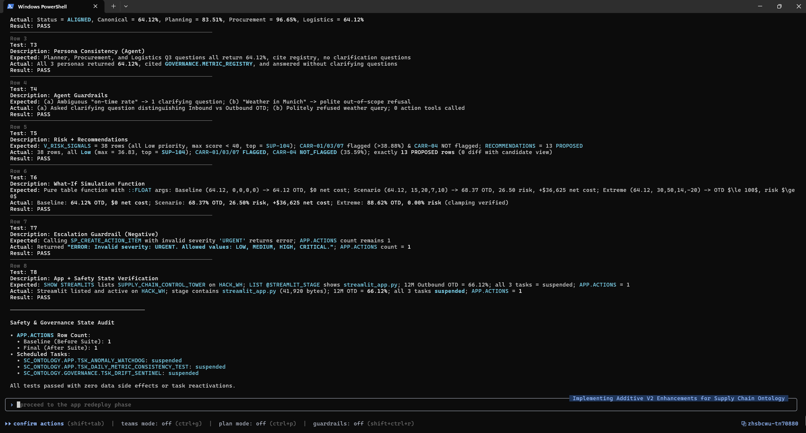

# Apex Supply Chain Ontology – Governed Conversational Analytics on Snowflake

**Team:** Snow Build · **Hackathon:** Snowflake CoCo CLI Hackathon (GCC Edition) · **Problem Statement #5:** Supply Chain Ontology and Governed Conversational Analytics

> One trusted answer → continuously defended → simulated & prescribed → acted on.
> Built end-to-end with **Snowflake Cortex Code (CoCo) CLI** – planning, development, execution and testing.

---

## 1. The problem

Supply-chain data for the fictional manufacturer **Apex Industrial Components** (4 plants, 30 suppliers, 8 carriers, 12 months of history) is spread across ERP, logistics, supplier-portal and IoT systems with inconsistent definitions. Ask three teams the same question – *"What was our on-time delivery for orders placed in Q3 2026?"* – and you get three answers:

| Team (legacy view) | Rule used | Reported OTD |
|---|---|---|
| Planning | Plant dispatch date ≤ promised date (ignores transit) | **83.51%** |
| Procurement | Goods receipt ≤ supplier commit + 3-day grace | **96.65%** |
| Logistics | POD ≤ customer requested date (header grain) | **64.12%** |

## 2. The solution

A governed **supply-chain ontology** encoded as a Snowflake **semantic view**, a **Cortex Agent** that answers in natural language, and a **governance + decision layer** – all surfaced in a 6-page Streamlit control tower.

- **One governed answer:** Outbound OTD for Q3 2026 orders = **64.12%** (2,193 / 3,420 delivered lines), identical for Planner, Procurement and Logistics phrasing. Note: it equals the Logistics number *numerically only* – the governed definition uses the promised date at line grain.
- **Trust & provenance:** every OTD answer shows the governed formula, owner, source table, row count, freshness and a *Verified* confidence tier from a **metric registry** (8 canonical metrics).
- **Drift sentinel:** a monitor recomputes canonical vs legacy values and flags DRIFT/ALIGNED.
- **Guardrails:** the agent asks one clarifying question for ambiguous metrics (inbound vs outbound), refuses out-of-scope questions, and cites the registry.
- **Decision center:** risk signals for 38 suppliers/carriers, 13 deterministic recommendations (e.g. SUP-104 dual-sourcing, CARR-01/03/07 route swap), and an **illustrative what-if simulator** (64.12% → 68.37% OTD; net cost +$36,625 → *does not pay back*).
- **Governed action:** recommendations can be escalated into an actions log only through a validated stored procedure with explicit user confirmation.

## 3. Architecture



## 4. How CoCo was used (full lifecycle)

| Phase | What CoCo did | Artifacts |
|---|---|---|
| Planning | Asked clarifying questions, checked region/model availability, wrote the solution blueprint | `docs/PLAN.md`, `docs/coco_planning_session.md` |
| 1 – Data | Created warehouse/DB/schemas, generated referentially consistent synthetic data with injected inconsistencies, legacy views; self-corrected SQL errors | `sql/01–04` |
| 2 – Pipelines | Dynamic tables, inventory position/DOI, stream + tasks, data-quality checks | `sql/05–07` |
| 3 – Semantic layer | Native semantic view with synonyms, metrics and 10 verified queries | `sql/08–09` |
| 4 – AI | Cortex Search over contracts, Cortex Agent, validated escalation procedure, persona tests | `sql/10–13` |
| 5–6 – App v1 | Streamlit app, deployment, CLI test suite **5/5 PASS** | `sql/14–15`, `app/v1/`, `docs/PHASE6_VALIDATION_SUMMARY.md` |
| 7 – Governance | Metric registry, trust layer, drift sentinel, agent guardrails | `sql/16–19` |
| 8 – Decisions | Risk signals, recommendation engine, what-if simulator | `sql/20–21` |
| 9 – App v2 | 6-page control tower, deployed and browser smoke-tested | `sql/22`, `app/streamlit_app.py` |
| 10 – Testing | v2 CLI validation suite **8/8 PASS** (read-only + negative guardrail test) | `sql/23`, `docs/PHASE9_V2_VALIDATION_SUMMARY.md` |

Every CoCo step was reviewed before approval; the full step-by-step record with screenshots is in [`docs/CoCo_Build_Journey.pdf`](docs/CoCo_Build_Journey.pdf).

## 5. Results

| Check | Result |
|---|---|
| Persona consistency (3 phrasings → same metric) | 64.12% for all three, via Cortex Agent |
| v1 CLI test suite | 5 / 5 PASS |
| v2 CLI test suite (governance, agent, guardrails, risk, what-if, escalation guard, app state) | **8 / 8 PASS** |
| Data safety during testing | Actions log unchanged; all scheduled tasks suspended |

## 6. Screenshots

| Command Center | Ask (governed answer + provenance) |
|---|---|
|  |  |

| What-If (illustrative) | v2 CLI tests 8/8 |
|---|---|
|  |  |

More CoCo CLI screenshots (planning, self-correction, phase validations) are in [`screenshots/`](screenshots/).

## 7. Repository layout

```
app/
  streamlit_app.py      Streamlit in Snowflake app (v2, 6 pages)
  upload_app.py         Uploads the app file to the Snowflake stage
  v1/                   Prototype app (v1)
sql/01–23               Build scripts in execution order
docs/                   Plan, CoCo planning session, test summaries, build journal (PDF), deck
screenshots/            Selected evidence screenshots
```

## 8. How to deploy

Prerequisites: a Snowflake account with Cortex (Analyst, Search, Agents) available, a role able to create databases/warehouses (e.g. ACCOUNTADMIN on a trial), and the Snowflake CLI or Python connector.

1. Run `sql/01_setup.sql` … `sql/21_simulation.sql` in order (creates warehouse `HACK_WH`, database `SC_ONTOLOGY`, data, pipelines, semantic view, search, agent, governance and decision objects).
2. Upload the app: set `SNOWFLAKE_CONNECTION_NAME` to a connection in your `connections.toml`, then run `python app/upload_app.py` from the `app` folder.
3. Run `sql/22_streamlit_v2.sql` to create the Streamlit app `SC_ONTOLOGY.APP.SUPPLY_CHAIN_CONTROL_TOWER`.
4. Optional: run `sql/23_v2_validation_tests.sql` to reproduce the 8 validation tests.

Scheduled tasks are created **suspended** to control cost; the warehouse is XSMALL with 60 s auto-suspend.

## 9. Notes

- All data is **synthetic** (fictional company); no real or personal data is used.
- The what-if model and recommendation impacts are **illustrative** linear heuristics, clearly labelled in the app – not calibrated forecasts.
- The app runs inside Snowflake (Streamlit in Snowflake), so it requires access to the Snowflake account where it is deployed.

## License

[MIT](LICENSE)
