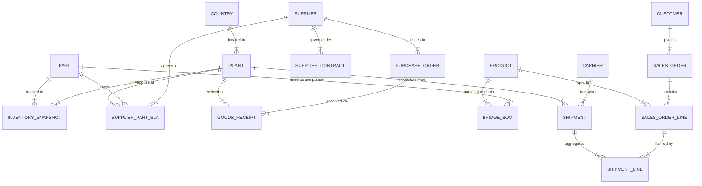

# Supply Chain Ontology & Governed Conversational Analytics
## Implementation & Architecture Blueprint: Apex Industrial Components

---

### Executive Overview & Snowflake Environment Status
* **Account Region**: AWS `ap-south-1` (Mumbai), Snowflake Version 10.35.101.
* **Cross-Region Inference**: `CORTEX_ENABLED_CROSS_REGION` is verified as **`ANY_REGION`** (enabled at account level).
* **Role**: `ACCOUNTADMIN` (all necessary Cortex AI function privileges and administrative rights are available).
* **Warehouse**: `HACK_WH` (Warehouse Size: `XSMALL`, `AUTO_SUSPEND = 60`, `AUTO_RESUME = TRUE`).
* **Credit Footprint**: Total estimated compute across all build and test phases is **< 0.20 credits**.

---

### 1. Problem Framing & Success Criteria

#### 1.1 Business Context
Apex Industrial Components is a mid-sized global industrial manufacturer operating:
* **4 Manufacturing & Assembly Plants**: `US-TX-01` (Austin, US), `DE-BY-02` (Munich, Germany), `VN-BD-03` (Binh Duong, Vietnam), `US-OH-04` (Columbus, US).
* **Supply Network**: 30 tiered suppliers, 200 parts/components, 50 finished industrial products, 100 enterprise customers, and 8 logistics carriers across 12 months of operations.

#### 1.2 The Core Problem
Supply chain data is fragmented across ERP, Logistics TMS, Supplier Web Portals, and IoT tracking streams. Crucially, each department uses disparate, non-standardized definitions for critical metrics:
* **Planning Team**: Measures On-Time Delivery (OTD) based on *Promised Ship Date vs Actual Ship Date* (ignoring transportation transit time).
* **Procurement Team**: Measures Inbound Supplier OTD based on *Supplier Acknowledged Date vs Goods Receipt Date* (granting a 3-day grace period).
* **Logistics Team**: Measures Outbound Customer OTD based on *Customer Requested Date vs Proof of Delivery (POD) Timestamp* (penalizing logistics even when customer order was placed late).

When executive leadership asks *"What was our Q3 On-Time Delivery performance?"*, each VP presents a different number (Planning: ~81%, Procurement: ~89%, Logistics: ~74%), destroying trust in analytics.

#### 1.3 Success Criteria
1. **Single Source of Semantic Truth**: Establish a conformed supply chain ontology in Snowflake exposed via a native `SEMANTIC VIEW` (`SEMANTIC.SV_SUPPLY_CHAIN_INTELLIGENCE`).
2. **Zero Metric Divergence**: When Planner, Procurement Manager, and Logistics Manager personas ask delivery questions in their native terminology, Cortex Analyst & Agent return the **exact same canonical figure** and display the standardized formula.
3. **Unstructured Contract Intelligence**: Cortex Search over `RAW.SUPPLIER_CONTRACTS` instantly surfaces SLA terms and penalty clauses during supplier performance reviews.
4. **Closed-Loop Actionability**: Natural language anomaly discovery directly triggers governed workflow records in `APP.ACTIONS` via a Cortex Agent tool.

---

### 2. Demo Story: 5 Personas, Questions, Answers & Actions

*(Note: Numerical values below are design targets; actual values will be computed directly from the synthetic dataset).*

| # | Persona | Natural Language Question | Governing Engine | Canonical Answer (Target) | Follow-Up Action |
| :- | :--- | :--- | :--- | :--- | :--- |
| **1** | **Logistics VP (The "Before" Conflict)** | *"What was our customer OTD for Q3?"* | `LEGACY.VW_LOGISTICS_OTD` vs `LEGACY.VW_PLANNING_OTD` | **Conflicting Output**: Logistics shows **~74.2%**, Planning shows **~81.5%**. | Demonstrates why leadership cannot trust current un-governed reporting. |
| **2** | **Planner / Procurement / Logistics (The "After" Unity)** | *Planner*: "Outbound OTD across all plants for Q3?"<br>*Procurement*: "Customer delivery timeliness last quarter?"<br>*Logistics*: "What was our quarterly customer on-time percentage?" | Cortex Agent on `SEMANTIC.SV_SUPPLY_CHAIN_INTELLIGENCE` | **Unified Output**: **~76.8%** across all personas with exact formula: `100.0 * COUNT(delivered on or before promised) / COUNT(total delivered)`. | Proves zero metric divergence across distinct departmental phrasings. |
| **3** | **Procurement Manager (Anomaly Detection)** | *"Which suppliers have an OTIF below 70% and significant lead time variance?"* | Cortex Agent (Analyst Tool) | Identifies **Titan Micro-Foundry (SUP-104)** with **~64.0% OTIF** and **+14.2 days** average lead time overrun on Titanium Fasteners (`PART-TF-88`). | Flags high-risk supplier for contract SLA review. |
| **4** | **Procurement Manager (Contract SLA Search)** | *"What are the contractual SLA terms and penalty clauses for Titan Micro-Foundry?"* | Cortex Agent (Cortex Search on `RAW.SUPPLIER_CONTRACTS`) | Retrieves Section 4.2: *"Supplier shall maintain ≥95% OTIF. Performance below 80% incurs a 5% invoice rebate penalty and mandatory executive review within 48h."* | Pinpoints specific legal remedy and contract clause. |
| **5** | **Supply Chain Director (Closed-Loop Action)** | *"Create a Level-2 Supplier Escalation action ticket for Titan Micro-Foundry regarding Titanium Fastener delays and invoke the 5% penalty clause."* | Cortex Agent Custom Tool (`APP.SP_CREATE_ACTION_ITEM`) | Stored procedure logs Action Ticket **`#ACT-2026-089`** in `APP.ACTIONS` with status `OPEN_PENDING_REVIEW`. | Closes the loop from insight to governed operational action. |

---

### 3. Supply Chain Ontology Model



#### Hierarchical Dimensions
* **Geography**: `Global -> Region (AMER, EMEA, APAC) -> Country (US, DE, VN) -> Plant / Facility`
* **Materials & Products**: `Part Category (Electronics, Precision Mechanical, Fasteners, Raw Metals) -> Part SKU -> Product Family (Robotics, Fluid Power, Industrial Drives) -> Finished Product SKU`
* **Supply Base**: `Supplier Tier (Tier-1 Strategic, Tier-2 Preferred, Tier-3 Tactical) -> Supplier Account`
* **Customer Base**: `Customer Segment (Automotive OEM, Aerospace Systems, Heavy Machinery) -> Customer Account`

---

### 4. Table-by-Table Schema Specifications

#### Database: `SC_ONTOLOGY`

#### 4.1 `RAW` Schema (Simulating Messy Source Systems)
All CURATED entities have a corresponding upstream RAW source.

| Table Name | Primary Key | Description & Key Columns |
| :--- | :--- | :--- |
| `RAW.ERP_PLANTS` | `PLANT_CODE` | `PLANT_CODE`, `PLANT_NAME`, `CITY`, `COUNTRY_CODE`, `REGION`, `TZ_OFFSET` |
| `RAW.ERP_SUPPLIERS` | `VENDOR_ID` | `VENDOR_ID` (e.g. `VEND-0104`), `VENDOR_NAME`, `TIER_CODE`, `COUNTRY`, `STATUS_FLAG` |
| `RAW.ERP_PARTS` | `MATERIAL_NO` | `MATERIAL_NO`, `DESCRIPTION`, `COMMODITY_GROUP`, `BASE_UOM`, `STD_COST_LOCAL`, `LOCAL_CURR` |
| `RAW.ERP_PRODUCTS` | `MATNR_FG` | `MATNR_FG`, `PRODUCT_NAME`, `PROD_FAMILY`, `LIST_PRICE_USD` |
| `RAW.ERP_CUSTOMERS` | `KUNNR` | `KUNNR`, `NAME_ORG`, `INDUSTRY_SECTOR`, `COUNTRY`, `REGION` |
| `RAW.ERP_BILL_OF_MATERIALS` | `BOM_ID` | `BOM_ID`, `PARENT_MATNR`, `CHILD_MATNR`, `COMPONENT_QTY`, `UOM`, `SCRAP_PCT` |
| `RAW.ERP_PURCHASE_ORDERS` | `PO_LINE_ID` | `PO_LINE_ID`, `PO_HEADER_NO`, `VENDOR_CODE`, `MATERIAL_NUM`, `PLANT_CODE`, `ORDER_DATE_STR`, `PROMISED_DATE_STR`, `ORDER_QTY_STR`, `UNIT_COST_LOCAL`, `CURR_CODE` |
| `RAW.ERP_GOODS_RECEIPTS` | `GR_LINE_ID` | `GR_LINE_ID`, `PO_LINE_REF`, `RECEIPT_DATE_STR`, `QUANTITY_RCVD_STR`, `INSPECTION_CODE`, `INBOUND_FREIGHT_LOCAL`, `HANDLING_COST_LOCAL`, `DUTY_COST_LOCAL` |
| `RAW.ERP_SALES_ORDERS` | `SO_NUMBER` | `SO_NUMBER`, `CUST_ID`, `SO_DATE_STR`, `REQ_DELIV_DATE_STR`, `HEADER_STATUS`, `TOTAL_VAL_USD` |
| `RAW.ERP_SALES_ORDER_LINES`| `SO_LINE_ID` | `SO_LINE_ID`, `SO_NUMBER`, `PRODUCT_SKU`, `ORDER_QTY`, `UNIT_PRICE_USD`, `PLANT_FULFILL` |
| `RAW.ERP_INVENTORY_SNAPSHOTS`| `INV_SNAP_ID`| `INV_SNAP_ID`, `SNAP_DATE_STR`, `PLANT_CODE`, `MATERIAL_NO`, `STOCK_ON_HAND`, `SAFETY_STOCK_MIN`, `DAILY_USAGE_30D` |
| `RAW.LOGISTICS_CARRIERS` | `CARRIER_CODE` | `CARRIER_CODE`, `CARRIER_NAME`, `MODE`, `RELIABILITY_RATING` |
| `RAW.LOGISTICS_SHIPMENTS` | `SHIPMENT_NO` | `SHIPMENT_NO`, `CARRIER_ID`, `ORIGIN_PLANT`, `DEST_CUSTOMER`, `DISPATCH_TS_STR`, `DELIVERY_TS_STR`, `STATUS`, `FREIGHT_CHARGE_USD`, `IS_BACKORDERED_FLAG` |
| `RAW.LOGISTICS_SHIPMENT_LINES`| `SHIP_LINE_ID` | `SHIP_LINE_ID`, `SHIPMENT_NO`, `SO_LINE_REF`, `PRODUCT_ID`, `QTY_SHIPPED`, `QTY_DELIVERED` |
| `RAW.SUPPLIER_PORTAL_COMMITS` | `COMMIT_ID` | `COMMIT_ID`, `PORTAL_SUPP_ID`, `PO_LINE_REF`, `ACKNOWLEDGED_DATE_STR`, `SUPPLIER_PROMISED_DATE`, `COMMITTED_QTY` |
| `RAW.IOT_TELEMETRY` | `EVENT_ID` | `EVENT_ID`, `DEVICE_ID`, `SHIPMENT_NO`, `LATITUDE`, `LONGITUDE`, `TEMPERATURE_C`, `SHOCK_G`, `EVENT_TIMESTAMP` |
| `RAW.SUPPLIER_CONTRACTS` | `CONTRACT_ID` | `CONTRACT_ID`, `SUPPLIER_CODE`, `SUPPLIER_NAME`, `CONTRACT_TITLE`, `EFFECTIVE_DATE`, `EXPIRATION_DATE`, `TARGET_OTIF_PCT`, `CONTRACT_LEAD_TIME_DAYS`, `PENALTY_TERMS`, `FULL_CONTRACT_TEXT` |

#### 4.2 `LEGACY` Schema (Demonstrating Metric Discrepancies)
1. `LEGACY.VW_PLANNING_OTD`:
   * Measures OTD using `ERP_SALES_ORDERS.REQ_DELIV_DATE_STR` vs `LOGISTICS_SHIPMENTS.DISPATCH_TS_STR`. Treats dispatch from plant as "delivery".
2. `LEGACY.VW_PROCUREMENT_OTD`:
   * Measures Inbound OTD using `SUPPLIER_PORTAL_COMMITS.SUPPLIER_PROMISED_DATE` vs `ERP_GOODS_RECEIPTS.RECEIPT_DATE_STR` with a +3 day grace window.
3. `LEGACY.VW_LOGISTICS_OTD`:
   * Measures Outbound OTD using `ERP_SALES_ORDERS.REQ_DELIV_DATE_STR` vs `LOGISTICS_SHIPMENTS.DELIVERY_TS_STR`. Penalizes all transit delays regardless of plant dispatch performance.

#### 4.3 `CURATED` Schema (Conformed, Governed Layer)

```sql
-- Dimensions
DIM_DATE (DATE_KEY PK, FULL_DATE, YEAR, QUARTER, MONTH_NUM, MONTH_NAME, WEEK_OF_YEAR, IS_WEEKEND)
DIM_PLANT (PLANT_KEY PK, PLANT_CODE, PLANT_NAME, CITY, COUNTRY, REGION, TIMEZONE)
DIM_SUPPLIER (SUPPLIER_KEY PK, SUPPLIER_ID, SUPPLIER_NAME, TIER, COUNTRY, REGION, STATUS)
DIM_PART (PART_KEY PK, PART_NUMBER, PART_NAME, CATEGORY, UNIT_OF_MEASURE, STANDARD_COST_USD, IS_CRITICAL)
DIM_PRODUCT (PRODUCT_KEY PK, PRODUCT_SKU, PRODUCT_NAME, FAMILY, BASE_PRICE_USD)
DIM_CUSTOMER (CUSTOMER_KEY PK, CUSTOMER_ID, CUSTOMER_NAME, SEGMENT, COUNTRY, REGION)
DIM_CARRIER (CARRIER_KEY PK, CARRIER_CODE, CARRIER_NAME, TRANSPORT_MODE, RATING)
BRIDGE_BILL_OF_MATERIALS (BOM_KEY PK, PRODUCT_KEY FK, PART_KEY FK, COMPONENT_QTY, SCRAP_FACTOR, IS_ACTIVE)
DIM_SUPPLIER_PART_SLA (SLA_KEY PK, SUPPLIER_KEY FK, PART_KEY FK, PLANT_KEY FK, CONTRACT_LEAD_TIME_DAYS, TARGET_OTIF_PCT, UNIT_PURCHASE_PRICE_USD, PENALTY_CLAUSE_TEXT)

-- Facts
FACT_SALES_ORDERS (
    SALES_ORDER_KEY PK, SALES_ORDER_NUMBER, CUSTOMER_KEY FK, ORDER_DATE_KEY FK, 
    REQUESTED_DELIVERY_DATE_KEY FK, ORDER_STATUS, TOTAL_ORDER_AMOUNT_USD
)

FACT_PURCHASE_ORDERS (
    PO_LINE_KEY PK, PO_NUMBER, SUPPLIER_KEY FK, PART_KEY FK, PLANT_KEY FK, 
    ORDER_DATE_KEY FK, PROMISED_DATE_KEY FK, DELIVERY_DATE_KEY FK,
    ORDER_QTY, RECEIVED_QTY, UNIT_PRICE_USD, EXTENDED_PURCHASE_COST_USD,
    INBOUND_FREIGHT_USD, DUTY_COST_USD, HANDLING_COST_USD,
    LEAD_TIME_ACTUAL_DAYS, LEAD_TIME_CONTRACT_DAYS,
    IS_DELIVERED, IS_ON_TIME_INBOUND, IS_IN_FULL_INBOUND
)

FACT_OUTBOUND_SHIPMENTS (
    SHIPMENT_LINE_KEY PK, SHIPMENT_NUMBER, SALES_ORDER_KEY FK, CUSTOMER_KEY FK, 
    PLANT_KEY FK, PRODUCT_KEY FK, CARRIER_KEY FK,
    ORDER_DATE_KEY FK, PROMISED_DELIVERY_DATE_KEY FK, ACTUAL_DELIVERY_DATE_KEY FK,
    ORDERED_QTY, SHIPPED_QTY, DELIVERED_QTY,
    FREIGHT_COST_USD, HANDLING_COST_USD,
    IS_DELIVERED, IS_ON_TIME_OUTBOUND, IS_IN_FULL_OUTBOUND, IS_BACKORDERED
)

FACT_INVENTORY_DAILY (
    INV_SNAPSHOT_KEY PK, SNAPSHOT_DATE_KEY FK, SNAPSHOT_DATE, PLANT_KEY FK, 
    PART_KEY FK, ON_HAND_QTY, SAFETY_STOCK_QTY, DAILY_CONSUMPTION_QTY, INVENTORY_VALUE_USD
)
```

#### 4.4 `APP` Schema (Action Tickets & Logging)
1. `APP.ACTIONS`: `ACTION_ID` (PK), `ACTION_TYPE`, `TARGET_ENTITY_TYPE`, `TARGET_ENTITY_ID`, `SEVERITY`, `DESCRIPTION`, `STATUS`, `CREATED_BY`, `CREATED_AT`.
2. `APP.CONSISTENCY_LOG`: `LOG_ID` (PK), `CHECK_TIMESTAMP`, `METRIC_NAME`, `LEGACY_PLANNING_VAL`, `LEGACY_PROCUREMENT_VAL`, `LEGACY_LOGISTICS_VAL`, `CURATED_CANONICAL_VAL`, `STATUS`.

---

### 5. Canonical Metric Glossary

| Metric Name | Business Definition | Exact SQL Formula | Grain | Owner | Handling of Open/Undelivered Lines |
| :--- | :--- | :--- | :--- | :--- | :--- |
| **Inbound OTD %** | % of received purchase order lines delivered on or before agreed promised date | `100.0 * COUNT(CASE WHEN is_delivered = TRUE AND delivery_date_key <= promised_date_key THEN 1 END) / NULLIF(COUNT(CASE WHEN is_delivered = TRUE THEN 1 END), 0)` | Supplier / Plant / Month | Procurement | Open/pending PO lines (`is_delivered = FALSE`) are excluded from denominator and tracked in Open Backlog. |
| **Outbound OTD %** | % of completed customer shipment lines delivered on or before promised delivery date | `100.0 * COUNT(CASE WHEN is_delivered = TRUE AND actual_delivery_date_key <= promised_delivery_date_key THEN 1 END) / NULLIF(COUNT(CASE WHEN is_delivered = TRUE THEN 1 END), 0)` | Customer / Plant / Month | Logistics | Open/in-transit orders are excluded from denominator and monitored in Active Shipment Tracking. |
| **Inbound OTIF %** | % of received purchase order lines delivered both On-Time and 100% In-Full | `100.0 * COUNT(CASE WHEN is_delivered = TRUE AND delivery_date_key <= promised_date_key AND received_qty >= order_qty THEN 1 END) / NULLIF(COUNT(CASE WHEN is_delivered = TRUE THEN 1 END), 0)` | Supplier / Part / Month | Procurement | Excludes undelivered POs; partial open deliveries do not qualify as In-Full. |
| **Outbound OTIF %** | % of customer order lines delivered both On-Time and 100% In-Full | `100.0 * COUNT(CASE WHEN is_delivered = TRUE AND actual_delivery_date_key <= promised_delivery_date_key AND delivered_qty >= ordered_qty THEN 1 END) / NULLIF(COUNT(CASE WHEN is_delivered = TRUE THEN 1 END), 0)` | Customer / Product / Month | Planning | Excludes undelivered lines; partial shipments are flagged as failed OTIF. |
| **Fill Rate %** | % of total ordered volume delivered to customers | `100.0 * SUM(delivered_qty) / NULLIF(SUM(ordered_qty), 0)` | Product / Plant / Month | Planning | Evaluated across all closed and delivered orders. |
| **Days of Inventory (DOI)** | Number of days current inventory will sustain trailing 30-day consumption rate | *(See Exact SQL below)* | Plant / Part | Planning | Evaluated strictly against latest available snapshot date. |
| **Landed Cost ($/Unit)** | All-in unit procurement cost including extended item purchase price, inbound freight, duty, and handling | `(SUM(extended_purchase_cost_usd) + SUM(inbound_freight_usd) + SUM(duty_cost_usd) + SUM(handling_cost_usd)) / NULLIF(SUM(received_qty), 0)` | Part / Plant / Quarter | Procurement | Uses extended totals divided by delivered volume; excludes outbound freight. |
| **Supplier Lead Time Var** | Actual delivery lead time minus contracted SLA lead time in days | `AVG(lead_time_actual_days - lead_time_contract_days)` | Supplier / Part | Procurement | Measured only on delivered PO lines. |
| **Backorder Rate %** | % of customer order lines delayed due to immediate stock unavailability | `100.0 * COUNT(CASE WHEN is_backordered = TRUE THEN 1 END) / NULLIF(COUNT(shipment_line_key), 0)` | Product / Plant / Month | Planning | Includes both backordered delivered lines and currently backordered open lines. |

#### Exact SQL for Days of Inventory (DOI):
```sql
WITH latest_inv AS (
    SELECT plant_key, part_key, on_hand_qty, snapshot_date
    FROM CURATED.FACT_INVENTORY_DAILY
    QUALIFY ROW_NUMBER() OVER (PARTITION BY plant_key, part_key ORDER BY snapshot_date DESC) = 1
),
trailing_consumption AS (
    SELECT plant_key, part_key, AVG(daily_consumption_qty) AS avg_daily_consumption_30d
    FROM CURATED.FACT_INVENTORY_DAILY
    WHERE snapshot_date >= DATEADD('day', -30, (SELECT MAX(snapshot_date) FROM CURATED.FACT_INVENTORY_DAILY))
    GROUP BY plant_key, part_key
)
SELECT 
    l.plant_key,
    l.part_key,
    l.on_hand_qty,
    c.avg_daily_consumption_30d,
    ROUND(l.on_hand_qty / NULLIF(c.avg_daily_consumption_30d, 0), 1) AS days_of_inventory
FROM latest_inv l
JOIN trailing_consumption c ON l.plant_key = c.plant_key AND l.part_key = c.part_key;
```

---

### 6. Synthetic Data Strategy & Injected Narrative Patterns

#### 6.1 Generation Strategy
* 100% Native Snowflake SQL Stored Procedure `RAW.SP_GENERATE_SYNTHETIC_SUPPLY_CHAIN_DATA()`.
* Generates 12 months of clean chronological history using `TABLE(GENERATOR(ROWCOUNT => ...))` with deterministic seed values.

#### 6.2 Data Sizing Targets
* **Plants**: 4
* **Suppliers**: 30 (5 Tier-1 Strategic, 15 Tier-2 Preferred, 10 Tier-3 Tactical)
* **Parts**: 200 (Electronics, Precision Mechanical, Fasteners, Raw Materials)
* **Products**: 50 (Industrial Robotics, Fluid Automation, Power Transmissions)
* **Customers**: 100 (Automotive, Aerospace, Industrial Machinery)
* **Carriers**: 8 (Air, Ocean, Road Express, Rail)
* **Transaction Volumes**:
  * ~5,000 Purchase Order Lines
  * ~15,000 Outbound Shipment Lines
  * ~50,000 Daily Inventory Snapshot records
  * 30 Supplier Contracts & SLA documents in `RAW.SUPPLIER_CONTRACTS`

#### 6.3 Injected Real-World Inconsistencies (for Conformance Pipeline)
1. **Identifier Discrepancies**: Vendor codes formatted as `VEND-0104` in ERP, `SUP_0104` in Supplier Portal, and `TITAN_FOUNDRY_VN` in Logistics.
2. **Date Format Variations**: Raw strings contain `YYYY-MM-DD`, `DD/MM/YYYY`, and `MM-DD-YYYY HH24:MI:SS`.
3. **Currency & Unit Variations**: Costs in `EUR`, `VND`, `USD`; Part quantities in `PCS`, `EA`, `KG`, `LBS`.

#### 6.4 Injected Narrative Anomalies (Demo Showpieces)
1. **The Chronic Late Supplier (Titan Micro-Foundry, SUP-104)**:
   * Supplies Titanium Fasteners (`PART-TF-88`) to Plant `VN-BD-03`.
   * Exhibits **~64.0% Inbound OTIF** (vs 95% contractual SLA) and an average lead time variance of **+14.2 days**.
2. **The High-Impact Stockout Event**:
   * Critical component Microcontroller IC (`PART-MC-02`) suffers a 4-day stockout at Plant `US-TX-01` in August, driving Days of Inventory (DOI) to `0.0` and causing a surge in Backorder Rate on Finished Product `APEX-ROBOTIC-ARM-V2`.
3. **The Weather-Impacted Logistics Route**:
   * Carrier `Pacific Express (CARR-04)` has Outbound OTD drop to **~58.0%** on transpacific ocean lanes during July–August monsoon season.

---

### 7. Pipeline Architecture: Dynamic Tables & Streams/Tasks

```
[RAW Source Tables] 
       │
       ▼ (TARGET_LAG = '1 day' / DOWNSTREAM; manual refresh for demo)
[CURATED Conformed Dynamic Tables (Dims, Facts, Bridge)]
       │
       ▼
[SEMANTIC Governed Semantic View & Cortex Search Service]
```

#### 7.1 Dynamic Tables (`RAW -> CURATED`)
* **Cost Guardrail**: All Dynamic Tables configured with `TARGET_LAG = '1 day'` (or `DOWNSTREAM`) and initialized on `HACK_WH`.
* *Zero Idle Spend*: In the demo, pipelines are triggered manually via `ALTER DYNAMIC TABLE CURATED.<DT_NAME> REFRESH;`.
* Conforms messy vendor keys, standardizes units to canonical SI/EA, converts all currencies to USD via exchange lookup, and computes analytical flags (`is_delivered`, `is_on_time_inbound`, `is_in_full_inbound`).

#### 7.2 Ingestion Stream & Telemetry Watchdog Task
* **Stream**: `RAW.STM_IOT_TELEMETRY` on `RAW.IOT_TELEMETRY`.
* **Task**: `APP.TSK_ANOMALY_WATCHDOG`
  * Schedule: `SCHEDULE = '60 MINUTE'`
  * Condition: `WHEN SYSTEM$STREAM_HAS_DATA('RAW.STM_IOT_TELEMETRY')`
  * Action: Detects temperature excursions (>25°C for sensitive electronics) and physical shock (>5G), auto-inserting critical alerts into `APP.ACTIONS`.

#### 7.3 Automated Daily Metric Consistency Test Task
* **Task**: `APP.TSK_DAILY_METRIC_CONSISTENCY_TEST`
  * Schedule: `SCHEDULE = '1440 MINUTE'` (Daily)
  * Action: Runs an automated consistency assertion comparing `LEGACY.VW_PLANNING_OTD`, `LEGACY.VW_PROCUREMENT_OTD`, `LEGACY.VW_LOGISTICS_OTD`, and `CURATED.FACT_OUTBOUND_SHIPMENTS`. Logs delta discrepancies and validation status into `APP.CONSISTENCY_LOG`.

---

### 8. Semantic View Design (Cortex Analyst Foundation)

#### 8.1 Native Semantic View Object
```sql
CREATE OR REPLACE SEMANTIC VIEW SEMANTIC.SV_SUPPLY_CHAIN_INTELLIGENCE
  COMMENT = 'Governed Enterprise Supply Chain Semantic View for Apex Industrial Components'
  AS ...
```

#### 8.2 Semantic Structure
* **Tables**: `Dim_Date`, `Dim_Plant`, `Dim_Supplier`, `Dim_Part`, `Dim_Product`, `Dim_Customer`, `Dim_Carrier`, `Fact_Purchase_Orders`, `Fact_Outbound_Shipments`, `Fact_Inventory_Daily`, `Bridge_BOM`, `Supplier_Part_SLA`.
* **Dimensions & Synonyms**:
  * `supplier_name`: "vendor", "supplier", "provider", "manufacturer".
  * `plant_name`: "factory", "facility", "site", "manufacturing plant", "location".
  * `customer_name`: "client", "buyer", "account".
  * `product_name`: "finished good", "product sku", "assembly".
* **Metrics**:
  * `inbound_otd_pct`: "inbound on-time delivery", "supplier punctuality", "supplier delivery rate".
  * `outbound_otd_pct`: "outbound on-time delivery", "customer on-time rate", "shipping schedule adherence".
  * `inbound_otif_pct`: "inbound OTIF", "supplier perfect order rate", "supplier on-time in-full".
  * `outbound_otif_pct`: "outbound OTIF", "customer OTIF", "perfect order fulfillment rate".
  * `days_of_inventory`: "DOI", "days forward cover", "stock cover duration", "inventory runway".
  * `landed_cost_per_unit`: "landed cost", "all-in procurement cost", "unit delivered cost".
  * `lead_time_variance_days`: "supplier lead time variance", "lead time delay", "delivery latency".
  * `backorder_rate_pct`: "backorder percentage", "stockout delay rate", "unfulfilled order rate".

#### 8.3 10 Verified Queries (VQRs)
1. **Monthly Outbound OTD by Plant**: Trends across 4 plants over 12 months.
2. **Inbound OTIF & Lead Time Variance by Supplier Tier**: Compares Tier-1 vs Tier-3 performance.
3. **Top 10 Parts by Total Unit Landed Cost**: Ranks all-in landed cost per part category.
4. **Days of Inventory (DOI) by Plant and Part Category**: Identifies critical inventory stockouts and overstock.
5. **Customer Outbound OTIF by Segment**: Compares Automotive OEM vs Aerospace fulfillment.
6. **Carrier Delivery Reliability & Freight Spend**: Ranks carriers by on-time delivery and average cost per shipment.
7. **Bottom 5 Suppliers by Inbound OTIF**: Evaluates chronic non-performing vendors.
8. **Finished Product Backorder Rate by Product Family**: Correlates component shortages to product delays.
9. **Inventory Valuation vs Safety Stock Deficits by Plant**: Identifies risk exposure across facilities.
10. **Supplier Contract SLA Adherence**: Compares actual delivered OTIF against contractual targets in `DIM_SUPPLIER_PART_SLA`.

---

### 9. Cortex Search & Cortex Agent Architecture

#### 9.1 Cortex Search Service: `SEMANTIC.CSS_SUPPLIER_CONTRACTS`
* **Source Table**: `RAW.SUPPLIER_CONTRACTS`
* **Search Column**: `FULL_CONTRACT_TEXT` (SLA commitments, penalty thresholds, lead time guarantees).
* **Attribute Columns**: `SUPPLIER_CODE`, `SUPPLIER_NAME`, `CONTRACT_ID`, `EFFECTIVE_DATE`.
* **Target Latency**: `1 day` (refreshed as contracts are updated).

#### 9.2 Cortex Agent Orchestration
* **Name**: `APP.SC_ONTOLOGY_AGENT`
* **Integrated Tools**:
  1. `cortex_analyst_tool`: Connected to `SEMANTIC.SV_SUPPLY_CHAIN_INTELLIGENCE` for structured SQL generation.
  2. `cortex_search_tool`: Connected to `SEMANTIC.CSS_SUPPLIER_CONTRACTS` for SLA and contract text retrieval.
  3. `custom_tool_escalation`: Calls `APP.SP_CREATE_ACTION_ITEM(...)` to persist escalation tickets directly into `APP.ACTIONS`.

#### 9.3 System Instructions & Guardrails
* **Metric Transparency**: Every analytical response must explicitly display the canonical formula applied.
* **Disambiguation Guardrail**: If a user asks for "OTD" without specifying Inbound (Supplier) vs Outbound (Customer), the agent must prompt the user for clarification before executing.
* **Scope Guardrail**: Questions unrelated to supply chain ontology (e.g. personal finance, general trivia) are politely declined.

---

### 10. Streamlit in Snowflake (SiS) Application Architecture

**App Object**: `APP.SUPPLY_CHAIN_CONTROL_TOWER`

#### 6 Dedicated Pages
1. 📊 **Executive Control Tower**: Interactive KPI summary cards (Outbound OTD, Inbound OTIF, Global DOI, Avg Landed Cost) with plant, region, and date range filters.
2. ⚡ **"Before vs After" Consistency Lab**: Live side-by-side comparison showing how Legacy un-governed queries yield 3 conflicting numbers, whereas the Governed Semantic View outputs a single, trusted truth.
3. 💬 **Multi-Persona Conversational Studio**: Interactive chat with pre-configured persona buttons (Planner, Procurement, Logistics) demonstrating consistent answers across distinct domain phrasing.
4. 🕸️ **Ontology & Lineage Explorer**: Interactive visual graph of entities, BOM multi-level hierarchy, and semantic relationships.
5. 📖 **Canonical Metric Glossary**: Searchable, interactive glossary detailing agreed business definitions, owners, SQL formulas, and underlying tables.
6. 🚨 **Action & Escalation Tracker**: Real-time log of automated IoT alerts and agent-generated supplier escalation tickets (`APP.ACTIONS`).

---

### 11. Test & Validation Plan

1. **Persona Consistency Assertion**: Run automated script executing 3 distinct persona phrasing queries per metric (9 total test prompts) and assert zero mathematical delta.
2. **Data Conformance & Referential Integrity**: Execute automated SQL spot checks ensuring zero orphan foreign keys between Curated Facts and Dimensions.
3. **Data Quality Metrics (DMFs)**: Attach Snowflake Data Metric Functions to `CURATED.FACT_OUTBOUND_SHIPMENTS` validating `NULL_COUNT = 0` on foreign keys and date sequence sanity (`order_date <= promised_date`).
4. **Cortex Search Recall**: Validate precision on 5 specific SLA penalty search queries against `RAW.SUPPLIER_CONTRACTS`.

---

### 12. Phased Build Plan & Verification Stops

Each phase is self-contained. Execution will pause after each phase for review and validation before continuing.

```
┌─────────────────────────────────────────────────────────────┐
│ Phase 1: Database, Schema, & Synthetic Data Generation       │
│ Review & Stop: Verify raw row counts & anomaly patterns     │
├─────────────────────────────────────────────────────────────┤
│ Phase 2: Curated Layer, Dynamic Tables, & Pipelines         │
│ Review & Stop: Verify curated conformance & stream watchdog │
├─────────────────────────────────────────────────────────────┤
│ Phase 3: Semantic Layer & Native Semantic View              │
│ Review & Stop: Execute & validate 10 verified queries (VQRs)│
├─────────────────────────────────────────────────────────────┤
│ Phase 4: Cortex Search Service & Cortex Agent Setup         │
│ Review & Stop: Test unstructured SLA search & action tool   │
├─────────────────────────────────────────────────────────────┤
│ Phase 5: Streamlit in Snowflake (SiS) Application           │
│ Review & Stop: Launch & test 6 pages in Snowsight           │
├─────────────────────────────────────────────────────────────┤
│ Phase 6: Automated End-to-End Validation & Demo Rehearsal   │
│ Final Sign-Off: Persona consistency test & audit log review │
└─────────────────────────────────────────────────────────────┘
```

#### Detailed Phase Breakdown:

| Phase | Scope & Deliverables | Verification Queries / Gate | Est. Credits |
| :--- | :--- | :--- | :--- |
| **Phase 1: Foundation & Data Gen** | Create DB `SC_ONTOLOGY`, Schemas (`RAW`, `LEGACY`, `CURATED`, `SEMANTIC`, `APP`), Warehouse `HACK_WH`, Stored Procedure for synthetic generation. | `SELECT COUNT(*) FROM RAW.ERP_PURCHASE_ORDERS;`<br>`SELECT * FROM RAW.SUPPLIER_CONTRACTS WHERE SUPPLIER_CODE = 'SUP-104';` | ~0.04 Credits |
| **Phase 2: Curated Pipelines** | Dynamic Tables for Dims/Facts/Bridge, `RAW.STM_IOT_TELEMETRY`, `APP.TSK_ANOMALY_WATCHDOG`, `APP.TSK_DAILY_METRIC_CONSISTENCY_TEST`. | `SELECT COUNT(*) FROM CURATED.FACT_OUTBOUND_SHIPMENTS;`<br>`SELECT * FROM CURATED.DIM_SUPPLIER_PART_SLA;` | ~0.03 Credits |
| **Phase 3: Semantic Layer** | Native `CREATE SEMANTIC VIEW SEMANTIC.SV_SUPPLY_CHAIN_INTELLIGENCE`, define metrics, dimensions, synonyms, and 10 VQRs. | Run 3 VQRs directly via SQL and verify metric accuracy. | ~0.02 Credits |
| **Phase 4: Cortex Search & Agent** | `SEMANTIC.CSS_SUPPLIER_CONTRACTS`, `APP.SP_CREATE_ACTION_ITEM`, and Cortex Agent configuration. | Query Cortex Search for "Titan Micro-Foundry SLA penalty" and test action creation procedure. | ~0.04 Credits |
| **Phase 5: Streamlit App** | Deploy `APP.SUPPLY_CHAIN_CONTROL_TOWER` (6 pages with chat and KPI tiles). | Verify app loads in Snowsight and chat responds via Cortex Analyst. | ~0.03 Credits |
| **Phase 6: Validation & Rehearsal** | Automated Persona Consistency Test, DMF attachments, demo dry run. | Run consistency assertion script; confirm 0 failures. | ~0.02 Credits |
| **Total** | **Complete Solution Delivery** | **Zero-Divergence Governed Supply Chain Platform** | **< 0.18 Credits** |

---
*Blueprint complete. Awaiting user review and authorization to proceed with Phase 1.*
