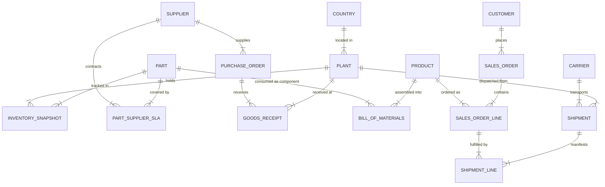

# Supply Chain Ontology & Governed Conversational Analytics
## Hackathon Architecture & Implementation Blueprint: "Apex Industrial Components"

---

### Region & Cortex Capability Assessment (AWS `ap-south-1`)
* **Account Region**: AWS `ap-south-1` (Mumbai), Snowflake 10.35.101.
* **Cross-Region Inference**: `CORTEX_ENABLED_CROSS_REGION` is **already enabled (`ANY_REGION`)**.
* **Model Routing**: Cross-region routing allows seamless invocation of state-of-the-art models (`claude-3-5-sonnet`, `claude-3-7-sonnet`, `llama3.3-70b`).
* **Required AI Grants**:
  ```sql
  GRANT DATABASE ROLE SNOWFLAKE.CORTEX_USER TO ROLE HACK_ROLE;
  GRANT DATABASE ROLE SNOWFLAKE.CORTEX_ANALYST_USER TO ROLE HACK_ROLE;
  GRANT DATABASE ROLE SNOWFLAKE.CORTEX_AGENT_USER TO ROLE HACK_ROLE;
  ```

---

### 1. Problem Framing & Success Criteria
* **Context**: Apex Industrial Components operates 4 plants across 3 countries (US, Germany, Vietnam) with ~30 suppliers, ~200 parts, ~50 finished products, and ~100 B2B customers.
* **The Problem**: Planning, Procurement, and Logistics teams query fragmented source systems (ERP, Logistics TMS, Supplier Portal, IoT Gateways) using conflicting metric definitions. For instance, when asked *"What was our Q3 On-Time Delivery rate?"*, Planning reports 81% (promised date vs ship date), Procurement reports 89% (supplier dock date), and Logistics reports 74% (customer requested date vs actual POD). Executives receive 3 conflicting numbers.
* **The Solution**: A unified Snowflake supply chain ontology mapped to a governed Semantic View and Cortex Agent, ensuring **one metric definition, one semantic model, and identical answers across all personas**.
* **Success Criteria**:
  1. **Zero Metric Divergence**: Planner, Procurement, and Logistics personas querying the same business metric in natural language receive identical numerical answers and identical formula lineage.
  2. **100% Traceable Ontological Alignment**: Every physical table conforms to standardized entities, hierarchies, and canonical units/currencies.
  3. **Closed-Loop Actionability**: Natural language anomaly discovery directly triggers governed workflow records (`APP.ACTIONS`).

---

### 2. Demo Story: 5 Persona Interactions & The "Before vs After" Climax
1. **The "Before" Crisis (Logistics Manager)**:
   * *Question*: "What is our customer On-Time Delivery (OTD) rate for the past quarter?"
   * *Legacy Answer*: Legacy Logistics view returns **74.2%** (measuring Requested Delivery Date vs Proof of Delivery).
   * *Conflict*: VP notes Planning reported **81.5%** and Procurement reported **89.0%** in the morning standup.
2. **The "After" Unified Answer (Planning, Procurement, & Logistics Personas)**:
   * *Question (Planner)*: "What is our canonical Outbound OTD for Q3 across all plants?"
   * *Governed Agent Answer*: Returns **76.8%** with standard formula `COUNT(IF actual_delivery_date <= promised_delivery_date) / COUNT(total_delivered_orders)`.
   * *Question (Procurement)*: "Show me customer delivery timeliness for Q3."
   * *Governed Agent Answer*: Returns **76.8%** — identical number, referencing the same semantic metric and formula.
3. **Drill-Down / Anomaly Discovery (Procurement Manager)**:
   * *Question*: "Which suppliers have an OTIF below 80% and significant lead time variance?"
   * *Agent Answer*: Identifies `SUP-104 (Apex Micro-Foundry)` with 68.4% OTIF and +14.2 days lead time variance for Titanium Fasteners.
4. **Unstructured Contract Intelligence (Procurement Manager)**:
   * *Question*: "What is our SLA clause and penalty term for Apex Micro-Foundry under contract?"
   * *Agent Action (Cortex Search)*: Retrieves Section 4.2 from `@RAW.STAGE_DOCS/contract_SUP-104.pdf`: *"Supplier shall maintain 95% OTIF. Failure below 80% triggers a 5% rebate penalty and executive review within 48 hours."*
5. **Closed-Loop Mitigation Action**:
   * *Prompt*: "Create a Level-2 Supplier Escalation action item for Apex Micro-Foundry regarding Titanium Fastener lead time delays."
   * *Agent Action (Stored Procedure Tool)*: Calls `APP.SP_CREATE_ACTION_ITEM(...)` and outputs Action Ticket `#ACT-2026-089` into `APP.ACTIONS`.

---

### 3. Supply Chain Ontology Model



#### Hierarchies
* **Geography**: `Global -> Region (AMER, EMEA, APAC) -> Country -> Plant / Site`
* **Product / Material**: `Part Category (Electronics, Mechanical, Fasteners, Raw Metals) -> Part -> Finished Product Line -> Product SKU`
* **Commercial**: `Supplier Tier (Tier-1 Strategic, Tier-2 Preferred, Tier-3 Tactical) -> Supplier`
* **Customer**: `Customer Segment (Automotive OEM, Aerospace, Heavy Machinery) -> Customer Account`

---

### 4. Table-by-Table Schema Specifications

#### Database: `SC_ONTOLOGY`

#### 4.1 `RAW` Schema (Simulating Messy Source Systems)
1. `RAW.ERP_PURCHASE_ORDERS`: `PO_ID`, `VENDOR_CODE`, `MATERIAL_NUM`, `QTY_ORDERED`, `ORDER_DATE_STR`, `PROMISED_DATE_STR`, `UNIT_COST_LOCAL`, `CURR_CODE`. (Dirty vendor codes, mixed date strings).
2. `RAW.ERP_GOODS_RECEIPTS`: `GR_ID`, `PO_ID`, `RCV_DATE_STR`, `QTY_RCVD`, `PLANT_CODE`, `INSPECTION_STATUS`.
3. `RAW.LOGISTICS_SHIPMENTS`: `SHIPMENT_TRACKING_NO`, `CARRIER_NAME`, `ORIGIN_PLANT`, `DEST_CUST_ID`, `DISPATCH_TS`, `DELIVERY_TS`, `STATUS`, `FREIGHT_CHARGE_USD`.
4. `RAW.SUPPLIER_PORTAL_COMMITS`: `PORTAL_SUPP_ID`, `PO_REF`, `SUPPLIER_ACK_DATE`, `PROMISED_SHIP_DATE`, `COMMITTED_QTY`, `LEAD_TIME_DAYS`.
5. `RAW.IOT_TELEMETRY`: `DEVICE_ID`, `SHIPMENT_TRACKING_NO`, `GEO_LAT`, `GEO_LONG`, `TEMP_C`, `SHOCK_DETECTED`, `RECORDED_AT`.
6. `RAW.STAGE_DOCS`: Stage holding supplier contracts, SLA agreements, and carrier terms in Markdown / PDF format.

#### 4.2 `LEGACY` Schema (Demonstrating Metric Discrepancies)
1. `LEGACY.VW_PLANNING_OTD`: Measures OTD based on `PROMISED_SHIP_DATE vs ACTUAL_SHIP_DATE` (ignores final customer delivery lag).
2. `LEGACY.VW_PROCUREMENT_OTD`: Measures Inbound OTD on `SUPPLIER_ACK_DATE vs GOODS_RECEIPT_DATE` (lenient supplier grace window).
3. `LEGACY.VW_LOGISTICS_OTD`: Measures Outbound OTD on `CUSTOMER_REQUEST_DATE vs PROOF_OF_DELIVERY` (penalizes carrier delays even if customer requested early).

#### 4.3 `CURATED` Schema (Conformed & Governed)
1. `DIM_DATE`: `DATE_KEY (PK)`, `FULL_DATE`, `YEAR`, `QUARTER`, `MONTH_NUM`, `MONTH_NAME`, `WEEK_OF_YEAR`, `IS_WEEKEND`.
2. `DIM_PLANT`: `PLANT_KEY (PK)`, `PLANT_CODE`, `PLANT_NAME`, `COUNTRY`, `REGION`, `LATITUDE`, `LONGITUDE`, `TIMEZONE`.
3. `DIM_SUPPLIER`: `SUPPLIER_KEY (PK)`, `SUPPLIER_ID`, `SUPPLIER_NAME`, `TIER`, `COUNTRY`, `REGION`, `STATUS`.
4. `DIM_PART`: `PART_KEY (PK)`, `PART_NUMBER`, `PART_NAME`, `CATEGORY`, `UNIT_OF_MEASURE`, `STANDARD_COST_USD`, `IS_CRITICAL`.
5. `DIM_PRODUCT`: `PRODUCT_KEY (PK)`, `PRODUCT_SKU`, `PRODUCT_NAME`, `FAMILY`, `BASE_PRICE_USD`.
6. `DIM_CUSTOMER`: `CUSTOMER_KEY (PK)`, `CUSTOMER_ID`, `CUSTOMER_NAME`, `SEGMENT`, `COUNTRY`, `REGION`.
7. `DIM_CARRIER`: `CARRIER_KEY (PK)`, `CARRIER_CODE`, `CARRIER_NAME`, `TRANSPORT_MODE`, `RATING`.
8. `FACT_PURCHASE_ORDERS`: `PO_LINE_KEY (PK)`, `PO_NUMBER`, `SUPPLIER_KEY (FK)`, `PART_KEY (FK)`, `PLANT_KEY (FK)`, `ORDER_DATE_KEY (FK)`, `PROMISED_DATE_KEY (FK)`, `DELIVERY_DATE_KEY (FK)`, `ORDER_QTY`, `RECEIVED_QTY`, `PURCHASE_PRICE_USD`, `DUTY_COST_USD`, `IS_ON_TIME_INBOUND`, `IS_IN_FULL_INBOUND`, `LEAD_TIME_ACTUAL_DAYS`, `LEAD_TIME_CONTRACT_DAYS`.
9. `FACT_INVENTORY_DAILY`: `INV_SNAPSHOT_KEY (PK)`, `DATE_KEY (FK)`, `PLANT_KEY (FK)`, `PART_KEY (FK)`, `ON_HAND_QTY`, `SAFETY_STOCK_QTY`, `DAILY_CONSUMPTION_QTY`, `INVENTORY_VALUE_USD`.
10. `FACT_OUTBOUND_SHIPMENTS`: `SHIPMENT_LINE_KEY (PK)`, `SHIPMENT_ID`, `SALES_ORDER_ID`, `CUSTOMER_KEY (FK)`, `PLANT_KEY (FK)`, `PRODUCT_KEY (FK)`, `CARRIER_KEY (FK)`, `ORDER_DATE_KEY (FK)`, `PROMISED_DELIVERY_DATE_KEY (FK)`, `ACTUAL_DELIVERY_DATE_KEY (FK)`, `ORDERED_QTY`, `SHIPPED_QTY`, `DELIVERED_QTY`, `FREIGHT_COST_USD`, `HANDLING_COST_USD`, `IS_ON_TIME_OUTBOUND`, `IS_IN_FULL_OUTBOUND`, `IS_BACKORDERED`.
11. `APP.ACTIONS`: `ACTION_ID (PK)`, `ACTION_TYPE`, `TARGET_ENTITY_TYPE`, `TARGET_ENTITY_ID`, `SEVERITY`, `DESCRIPTION`, `STATUS`, `CREATED_BY`, `CREATED_AT`.

---

### 5. Canonical Metric Glossary

| Metric Name | Business Definition | Exact SQL Formula | Granularity | Owner |
| :--- | :--- | :--- | :--- | :--- |
| **Inbound OTD %** | % of Purchase Order lines received on or before promised delivery date | `100.0 * COUNT(CASE WHEN delivery_date <= promised_date THEN 1 END) / NULLIF(COUNT(po_line_key), 0)` | Supplier / Plant / Month | Procurement |
| **Outbound OTD %** | % of Customer order lines delivered on or before promised delivery date | `100.0 * COUNT(CASE WHEN actual_delivery_date <= promised_delivery_date THEN 1 END) / NULLIF(COUNT(shipment_line_key), 0)` | Customer / Plant / Month | Logistics |
| **Inbound OTIF %** | % of Purchase Orders delivered both On-Time and In-Full (100% quantity) | `100.0 * COUNT(CASE WHEN delivery_date <= promised_date AND received_qty >= order_qty THEN 1 END) / NULLIF(COUNT(po_line_key), 0)` | Supplier / Part / Month | Procurement |
| **Outbound OTIF %** | % of Customer shipments delivered both On-Time and In-Full | `100.0 * COUNT(CASE WHEN actual_delivery_date <= promised_delivery_date AND delivered_qty >= ordered_qty THEN 1 END) / NULLIF(COUNT(shipment_line_key), 0)` | Customer / Product / Month | Planning |
| **Fill Rate %** | % of total ordered units fulfilled and delivered | `100.0 * SUM(delivered_qty) / NULLIF(SUM(ordered_qty), 0)` | Product / Customer / Month | Planning |
| **Days of Inventory (DOI)** | Number of days current inventory on hand will sustain daily consumption | `SUM(on_hand_qty) / NULLIF(AVG(daily_consumption_qty), 0)` | Plant / Part / Day | Planning |
| **Landed Cost ($)** | Total unit cost including purchase price, freight, duty, and handling | `SUM(purchase_price_usd + duty_cost_usd + freight_cost_usd + handling_cost_usd) / NULLIF(SUM(received_qty), 0)` | Part / Plant / Quarter | Procurement |
| **Supplier Lead Time Var** | Difference between actual lead time and agreed contractual SLA lead time | `AVG(lead_time_actual_days - lead_time_contract_days)` | Supplier / Part | Procurement |
| **Backorder Rate %** | % of customer order lines that could not be fulfilled from immediate stock | `100.0 * COUNT(CASE WHEN is_backordered = TRUE THEN 1 END) / NULLIF(COUNT(shipment_line_key), 0)` | Product / Plant / Month | Planning |

---

### 6. Synthetic Data Strategy & Injected Narrative Patterns
* **Data Generation Approach**: 100% Native Snowflake SQL Stored Procedures leveraging generator functions (`TABLE(GENERATOR(ROWCOUNT => ...))`), `UNIFORM`, `RANDSTR`, and date math.
* **Volume Profiles**:
  * 4 Plants (`US-TX-01`, `DE-BY-02`, `VN-BD-03`, `US-OH-04`)
  * 30 Suppliers, 200 Parts, 50 Products, 100 Customers, 8 Carriers
  * 12 Months of Daily History (~5,000 Purchase Orders, ~15,000 Outbound Shipments, ~50,000 Daily Inventory Snapshots)
* **Injected Inconsistencies for Curated Pipeline**:
  * Vendor ID discrepancies (`SUP_0104` in ERP vs `VEND-APEX-MF` in Portal vs `APEX_FOUNDRY_VN` in Logistics).
  * Date formats (`YYYY-MM-DD`, `DD/MM/YYYY`, `MM-DD-YYYY HH24:MI:SS`).
  * Currency & Unit conversions (`EUR`, `USD`, `VND`, `KG` vs `LBS`, `PCS` vs `EA`).
* **Story Anomalies**:
  1. *The Chronic Offender*: Supplier `Apex Micro-Foundry (SUP-104)` exhibits an OTIF of 64% and an average lead time overrun of +14 days on Titanium Fasteners (`PART-TF-88`).
  2. *The Critical Stockout*: Plant `US-TX-01` undergoes a 4-day stockout on Microcontrollers (`PART-MC-02`) in August, triggering a cascade of backorders on Finished Product `APEX-ROBOTIC-ARM-V2`.
  3. *Carrier Delay*: Carrier `Pacific Express (CARR-04)` has an outbound OTD rate of only 58% during monsoon season (July-August) affecting APAC-to-AMER routes.

---

### 7. Pipeline Architecture: Dynamic Tables & Streams/Tasks
* **Dynamic Tables (`RAW -> CURATED`)**:
  * Used for continuous dimension resolution, key conforming, unit standardization, and daily aggregations.
  * Target Lag: `1 MINUTE` (or `DOWNSTREAM`) for development demo; allows declarative SQL ELT.
* **Stream + Task (`Shipment Ingestion & Anomaly Interceptor`)**:
  * Stream `RAW.STM_IOT_TELEMETRY` on incoming IoT tracking table.
  * Task `APP.TSK_ANOMALY_WATCHDOG`: Runs every minute; detects shock/temperature SLA breaches and automatically writes alert records into `APP.ACTIONS`.

---

### 8. Semantic View Design (Cortex Analyst Foundation)
* **Object Name**: `SEMANTIC.SV_SUPPLY_CHAIN_INTELLIGENCE` (or Semantic Model YAML `supply_chain_model.yaml`).
* **Entities & Relationships Defined**: `Dim_Date`, `Dim_Plant`, `Dim_Supplier`, `Dim_Part`, `Dim_Product`, `Dim_Customer`, `Dim_Carrier`, `Fact_Purchase_Orders`, `Fact_Outbound_Shipments`, `Fact_Inventory_Daily`.
* **Synonyms & Context Mappings**:
  * `OTD` -> "on-time delivery", "delivery punctuality", "timeliness", "shipping schedule adherence".
  * `OTIF` -> "on-time in-full", "perfect order fulfillment", "complete delivery rate".
  * `DOI` -> "days of inventory", "days forward cover", "stock cover duration", "inventory runway".
  * `Landed Cost` -> "total landed cost", "all-in procurement cost", "unit delivered cost".
* **10 Verified Queries (VQRs)** covering multi-dimensional slicing:
  1. Monthly Outbound OTD by Plant.
  2. Inbound OTIF and Lead Time Variance by Supplier Tier.
  3. Top 5 Parts by Total Landed Cost.
  4. Days of Inventory (DOI) by Plant and Part Category.
  5. Backorder Rate by Finished Product Family.
  6. Carrier Delivery Performance and Average Freight Cost.
  7. Bottom 5 Suppliers by Inbound OTD in the last 90 days.
  8. Inventory Value vs Safety Stock Surplus/Deficit by Plant.
  9. Customer Segment OTIF comparison across quarters.
  10. Correlation between Carrier Delay and Total Outbound Shipping Cost.

---

### 9. Cortex Agent Architecture
* **Integrated Capabilities**:
  1. **Cortex Analyst**: Queries `SEMANTIC.SV_SUPPLY_CHAIN_INTELLIGENCE` for governed natural language to SQL.
  2. **Cortex Search**: Searches `@RAW.STAGE_DOCS` indexed service `SEMANTIC.CSS_SUPPLY_CHAIN_SLA` (Supplier Contracts, SLAs, Carrier Master Service Agreements).
  3. **Custom Tool (Stored Procedure)**: `APP.SP_CREATE_ACTION_ITEM(action_type, target_entity, severity, description)` for raising escalation tickets.
* **System Instructions & Guardrails**:
  * *Metric Formula Transparency*: Always state the canonical definition when answering metric queries.
  * *Disambiguation Protocol*: If a user asks for "OTD" without specifying Inbound (Supplier) vs Outbound (Customer), prompt the user for clarification before executing.
  * *Out-of-Scope Refusal*: Refuse non-supply-chain questions (e.g., HR, stock market speculation) with a polite redirect.

---

### 10. Streamlit in Snowflake (SiS) Application Architecture
* **App Name**: `APP.SUPPLY_CHAIN_CONTROL_TOWER`
* **Six Navigation Pages**:
  1. 📊 **Executive KPI Control Tower**: Real-time KPI metric tiles (Outbound OTD, Inbound OTIF, Global DOI, Avg Landed Cost) with interactive plant and date filters.
  2. ⚡ **"Before vs After" Consistency Lab**: Side-by-side comparison of Legacy (conflicting) metrics vs Curated Governed metrics.
  3. 💬 **Multi-Persona Conversational Studio**: Chat interface with persona presets (Planning, Procurement, Logistics) to demonstrate consistent answers across differing phrasing.
  4. 🕸️ **Ontology & Lineage Explorer**: Interactive visualization of supply chain entities, BOM relationships, and semantic mappings.
  5. 📖 **Canonical Metric Glossary**: Interactive dictionary of agreed formulas, SQL implementations, and department ownership.
  6. 🚨 **Action & Escalation Log**: Live view of automated alert tasks and agent-generated escalation tickets (`APP.ACTIONS`).

---

### 11. Test & Validation Plan
1. **Persona Consistency Test**: Automated script running 3 distinct phrasing queries per metric (9 total queries) and asserting identical numerical return values.
2. **Data Conformance Spot Checks**: Zero orphan foreign keys between Curated Facts and Dimensions (`100% referential integrity`).
3. **Data Quality Metrics (DMFs)**: Data Metric Functions attached to `CURATED.FACT_OUTBOUND_SHIPMENTS` checking `NULL_COUNT = 0` on delivery keys and `PERCENT_MATCH` on valid date ranges.
4. **Cortex Search Relevance**: Precision recall check on contract queries for all 30 supplier SLAs.

---

### 12. Build Phases & Credit Budget Estimation

| Phase | Description | Deliverables | Est. Execution Time | Est. Snowflake Credits |
| :--- | :--- | :--- | :--- | :--- |
| **Phase 1** | Schema & Synthetic Data Foundation | DDLs for `RAW`, `LEGACY`, `CURATED`, `APP` + Stored Proc Data Generator | ~3-5 mins | ~0.10 Credits |
| **Phase 2** | Curated Pipelines & Conformance | Dynamic Tables + Telemetry Stream/Task | ~2 mins | ~0.05 Credits |
| **Phase 3** | Semantic Model & Verified Queries | Semantic View YAML, Dimension/Metric definitions, 10 VQRs | ~3 mins | ~0.05 Credits |
| **Phase 4** | Cortex Search & Agent Setup | Stage Doc Generation, Cortex Search Service, Agent + Custom Tool | ~3 mins | ~0.15 Credits |
| **Phase 5** | Streamlit Control Tower App | Multi-page Streamlit application with live Chat and Visualizations | ~3 mins | ~0.10 Credits |
| **Phase 6** | Validation & Demo Rehearsal | Persona Consistency Test execution, Quality verification | ~2 mins | ~0.05 Credits |
| **Total** | **Complete Hackathon Implementation** | **End-to-End Governed Solution** | **~15-20 mins** | **< 0.50 Credits** |

---
**Status**: Ready to proceed with code generation and deployment upon plan approval.

---

## User Context

Do NOT build anything yet. Only do this: save the plan as PLAN.md in the current folder with these corrections, then STOP and wait for me.1. COST (critical): no task or dynamic table may run every minute on HACK_WH. Dynamic tables: TARGET_LAG = DOWNSTREAM or '1 day' (refresh manually for the demo). Stream task: use WHEN SYSTEM$STREAM_HAS_DATA and SCHEDULE = '60 MINUTE'. Add the daily metric consistency test task (was missing). Re-estimate credits realistically.2. ROLE: there is no HACK_ROLE. Use ACCOUNTADMIN for this hackathon (USE AI FUNCTIONS is already granted).3. RAW is incomplete: add ERP master and transaction sources for suppliers, parts, products, customers, BOM, sales orders and daily inventory, so every CURATED table has a RAW source.4. CURATED is missing tables shown in the ER diagram: DIM/BRIDGE for BOM, SUPPLIER_PART_SLA (contract lead time, OTIF target), and a sales order header. Add them.5. Landed Cost: FACT_PURCHASE_ORDERS needs inbound freight and handling columns (outbound freight is a different cost). Use extended amounts (qty x unit price), not unit prices, in the formula.6. OTD / OTIF: only count lines that are delivered (actual date not null). Say how open/undelivered lines are treated.7. DOI: on-hand quantity at the latest snapshot date divided by average daily consumption over the trailing 30 days. Write the exact SQL.8. Rename the late supplier: "Apex" is our own company name. Use "Titan Micro-Foundry" (SUP-104).9. Numbers in the demo story (76.8%, 68.4%, etc.) are targets only. Keep them consistent (section 6 says 64% OTIF, section 2 says 68.4%), and say that the real values will come from the generated data.10. Contracts: store the SLA documents as text rows in a RAW.SUPPLIER_CONTRACTS table (not PDFs) and build Cortex Search on that table.11. Semantic layer: use a native CREATE SEMANTIC VIEW object, not only YAML.12. Build phase by phase. Stop after each phase so I can review, with a short summary and verification queries.